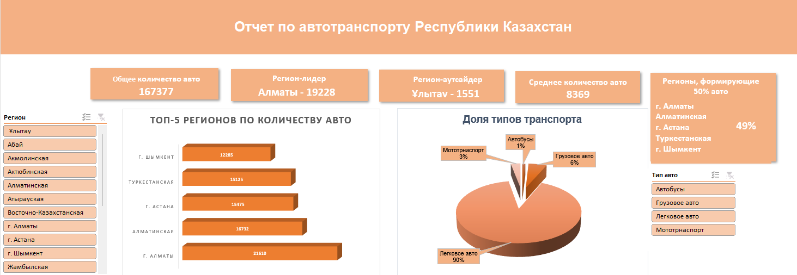

# 📊 Excel Dashboard — Анализ транспорта по регионам РК

В этом проекте представлен дашборд, созданный на Excel.  

## 📂 Содержимое
[Дашборд](./Excel%20Project%20Dashboard.xlsx) — Excel-файл с данными, сводными таблицами, KPI и дашбордом.  
[Скриншот](./Дашборд.png) — скриншот итогового дашборда.  
[README](./README.md) — описание проекта.

## 🔎 Основные элементы дашборда
- KPI карточки:  
  - Общее количество авто в стране  
  - Регион-лидер  
  - Регион-аутсайдер
  - Среднее количество авто
  - Регионы, формирующие 50% авто

- Диаграммы:  
  - Топ-5 регионов по количеству транспорта  
  - Доля видов транспорта (легковые, грузовые, автобусы, мотоциклы)  

- Срезы (фильтры): регионы, типы транспорта  

## 📷 Превью

